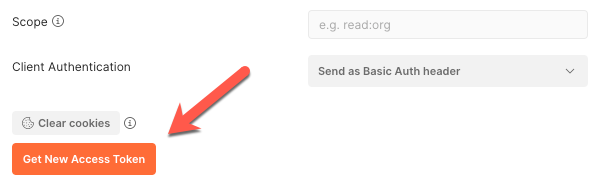
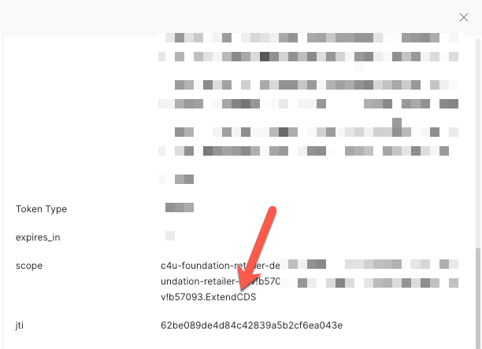

## Create our Access Token

Now that we have successfully created our service key, we can use the
above values to generate our Oauth2 access token. For this example, we
will be using Postman and curl.

BTP (Business Technology Platform) reference documentation can be found here:

[https://help.sap.com/viewer/65de2977205c403bbc107264b8eccf4b/Cloud/en-US/6391b5dfe4704c6c8b71a32126828e9c.html](https://help.sap.com/viewer/65de2977205c403bbc107264b8eccf4b/Cloud/en-US/6391b5dfe4704c6c8b71a32126828e9c.html)

Postman [https://www.postman.com/downloads/](https://www.postman.com/downloads/)

1. Start a new query and select the authorization tab. Choose as the
   type of authorization “Oauth 2.0”. For curl skip to the last step.


2. In the configure new token section add the information we have
   previously retrieved from the service key. Give your token a name
   and proceed filling in the required information.


i. Grant type = “Client Credentials” \
ii. Access token Url = (service key url) /oauth/token \

E.g. if our service key url was : [https://oursubaccount.authentication.eu10.hana.ondemand.com](https://oursubaccount.authentication.eu10.hana.ondemand.com)

Then the access token url would be: [https://oursubaccount.authentication.eu10.hana.ondemand.com/oauth/token](https://oursubaccount.authentication.eu10.hana.ondemand.com/oauth/token)

iii. Client ID = clientid from the service key \

iv. Client Secret = clientsecret from the service key. \

3. Click the “Get New Access Token” button.




4. You should receive a valid token dialog:


5. Double check that you have the correct scopes for this token.

Scroll down in the Token Details dialog until you reach the scope key and verify that the “ExtendCDS” scope is there.




If the scope is not there, double check to make sure you created the service instance with the correct json payload. (See above)

6. Click the “Use Token”. You can now share this token with other
   requests based on the name you have given it.


7. Test a simple get.

Using your subdomain, you should be able to query for metadata to make
sure our token is functioning properly.


8. In the response you should now see metadata returned from the Edom
   retailer.


   

9. If instead you need to retrieve the token using curl. Take the
   information you obtained previously for the clientid, clientsecret,
   url and plug them into the following command line:

```

curl --location --request POST '<url>/oauth/token'
--header 'Content-Type: application/x-www-form-urlencoded'
--header 'Authorization: Basic [base64.encoded(client_id:client_secret)](<base64.encoded(client_id:client_secret)>)'
--data-urlencode 'client_id=<client_id>'
--data-urlencode 'grant_type=client_credentials'

```

This will return the access token which you can use in another or
request or plug into postman as the value for the Authorization key.

Eg.\
Bearer: eyJhbGciOiJIUzI1NiIsInR5cCI6IkpXVCJ9.eyJzdWIiOiIxMjM0NTY3ODkwIiwibmFtZSI6IkpvaG4gRG9lIiwiaWF0IjoxNTE2MjM5MDIyfQ.SflKxwRJS
