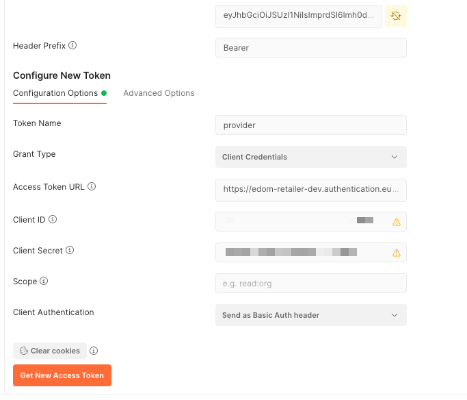

## Creating the Extension Project (VS Code) – Part II (Simple Extension)

Now that the directory structure has been created, we need to determine
what extensions we would like to make.

The following are some of the boundary conditions we have to keep in
mind before creating our extension:

1. Some entity names are reserved.

   As expected prefixes of namespace extensions cannot be prefixed with com.sap.\* or sap.\*

2. In accordance with SAP customer extensions best practices, elements must be prefixed with either “Z\_” or “Z\_\_”

3. The maximum number of new entities (db) is 42 and new fields (srv – services) is 5.

We will start with a simple extension and then gradually build up. 

As mentioned previously, as with any development project there should be
some type of version control.

Let’s get started, In this example we will extend CustomerOrder.
Make sure that you are logged into your subaccount using the cloud foundry command line.


1. In VSCode create a file in the outer db directory and name it
   extension1.cds (The naming of the file is not important
   however it must maintain the “.cds” extension)

   Add the following to the file (keeping in mind the boundary
   conditions from above)

```
using sap.odm.sales from '_base/db/models/odm/sales/CustomerOrder';

extend entity sales.CustomerOrder with {
    Z_NewField1 : String;
    Z_NewField2 : String;
}
```

2. Create a file in the outer srv directory and name it
   extension_service.cds (Again the naming of the file is not
   important however remember to maintain the “.cds” extension.

Add the following to the file:

```
using from '_base/srv/api/API_EDOM_RETAILER';
using from '../db/extension1';


extend projection API_EDOM_RETAILER.CustomerOrder with {
      Z_NewField1, Z_NewField2

}

```

3. Activate the extension.

We activate the extension by executing the following in the terminal:

```
cds activate -s edom-consumer-mtx
```

**Remember**:

In this case the “–to” represents the full url (subdomain + domain) the -s represents the subdomain

4. You may be prompted for a passcode.

   The passcode is found on the subdomain. In this case it would be:

   https://edom-consumer-mtx.authentication.eu10.hana.ondemand.com/passcode

5. The output from the command will be similar to:

   **Note:** The authentication token is not saved by default. To save the token for later commands, please run \`cds login\`.

```
Activating extension located at /Users/i820920/Documents/code/utilities/extensibility/cap/edom-retailer-core/extension-test-retailer-core2 to URL https://c4u-foundation-retailer-dev-service.cfapps.eu10.hana.ondemand.com
Activating extension...
Extension active
```

6. Congratulations the extension is now active!
7. As noted from the output above you can save the passcode token if
   you wish to continue modify the extension.


Once the extension has been activated, we need to verify if the data
exists.

In order to be able to query from postman we need authorization to be
able to view the data.

To get a new token from postman we need to query the authentication
point in the following dialog:




1. Retreive the Service Key that we used in the previous step taking the client Id, client secret and url.
2. The authentication url would be the url above + ‘/oauth/token’
3. Click “Get New Access Token”
4. Name and copy the token for your requests.

**Note** – The token has a time limit so you may need to generate a new
one, depending on how much time has elapsed since the previous time you
used it.