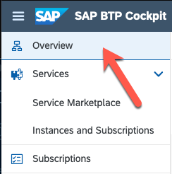
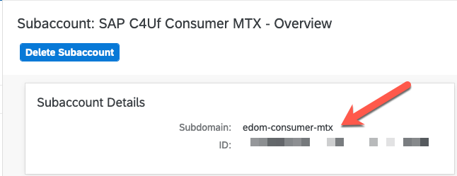
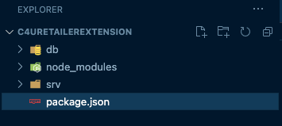

Before starting the extension, project be sure to have the following
setup:

1. Either SAP Business Application Studio or Visual Studio Code.
   You can find information on how to setup [here](https://cap.cloud.sap/docs/get-started/).
2. The cloud foundry command line [here](https://github.com/cloudfoundry/cli).

## Creating the Extension Project (VS Code) – Part I

The extension is always derived from the default provider application
(in this case, C4U CO Edom Retailer).

**Prerequisites:**

Before starting the extension project, there are a few prerequisites
required:

Variables:

1. The SAP Cloud for Utilities Foundation Retailer URL you will be
   extending: 
   >**The production version URL will be different

>https://c4u-foundation-retailer-dev-service.cfapps.eu10.hana.ondemand.com

1. Your subaccount.

   The subaccount in which you subscribed to the application (SAP Cloud for Utilities Foundation Retailer).

   From the SAP BTP Cockpit, choose Overview.




The Subaccount Subdomain will be listed in the main page such as:



**Note:** Custom Domain is not covered in this documentation.

2. Create an empty directory in a preferred location on your computer.
3. Open VS Code and choose the newly created directoy. (File -&gt;
   Open)
4. Prepare the final url:

- Create a new terminal in vscode
- Set the following env variable:

C4UDomain = >https://c4u-foundation-retailer-dev-service.cfapps.eu10.hana.ondemand.com

SUBDOMAIN= your subdomain

e.g. SUBDOMAIN = edom-consumer-mtx

- The extension is always based on the deployed version of the existing application.

**Note**: The domain-subdomain separator is a “.” in production not the
“-“ as listed in the line directly above.

5. Ensure you have been given the correct roles from the role template
   (at least ExtendCDS)

   **Please see above if this is not the case.**

6. Login to your Cloud Foundry space.

   If you are not in your cloud foundry space you may run into issues.

7. From the terminal execute the following command:

   Reference for the cds extend command can be found [here](https://cap.cloud.sap/docs/guides/extensibility#start-extension-project)

   ```
   cds extend -s edom-consumer-mtx https://c4u-foundation-retailer-dev-service.cfapps.eu10.hana.ondemand.com  -d (directory to create the extension)
   ```

   As a security precaution you will be prompted for a passcode. The passcode comes from your btp subaccount.

   Therefore, in this case the passcode would be:

   [https://edom-consumer-mtx.authentication.eu10.hana.ondemand.com/passcode](https://edom-consumer-mtx.authentication.eu10.hana.ondemand.com/passcode)

   **Note:** You can shorten the workflow to [save the
   passcode](https://cap.cloud.sap/docs/guides/extensibility#save-authentication-token-for-simplified-workflow)
   to not have to query on every iteration.

8. If everything is successful you will see a message similar to the
   following:

```
Creating extension project for https://c4u-foundation-retailer-dev-service.cfapps.eu10.hana.ondemand.com, subdomain 'edom-consumer-mtx', in folder '/Users/i820920/Documents/code/utilities/extensibility/cap/edom-retailer-core/extension-test-retailer-core2'
Retrieving files...

```

The following folder structure should be created:




Congratulations you are ready to start your new extension project!

**Note:** It is a best practice to use some type of version control to track
your extension project changes.