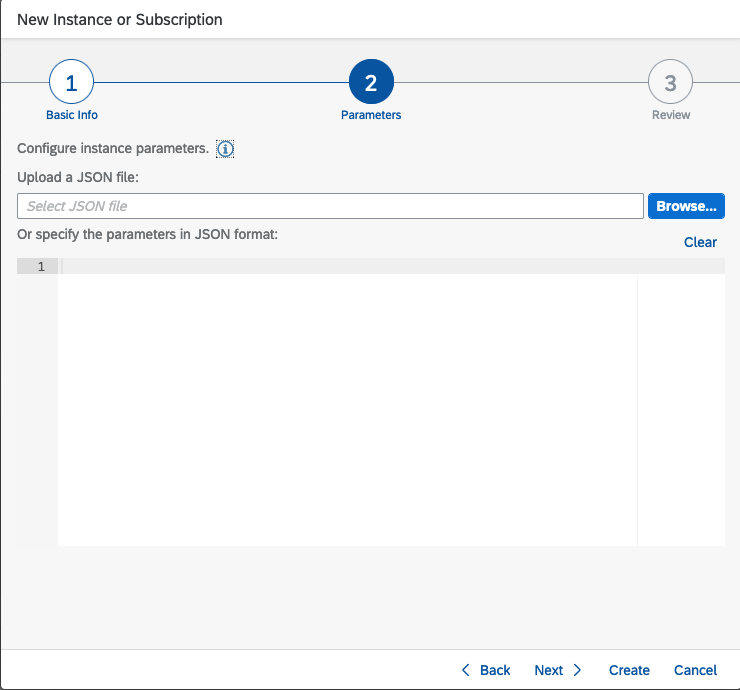

## Service Broker Instances

The service which implements the service broker API is referred to as
the “Service Broker”. A service instance represents varies. In our
context different service broker instances are created to offer
different scopes required by the calling application.

For instance, you may wish to setup a service broker with only API Read
or API Write rights. Extensibility is a special case and requires the
following scopes depending on your situation:

1. **ExtendCDS**

   Allows the extension developer to create and activate an extension.

2. **ExtendCDSDelete**

   Allows the extension developer to delete tables created by a previous extension.

These scopes are not given by default by edom retailer and require a new
service broker instance to be created with the above scopes to retrieve
the proper jwt token for acess.

Before starting ensure that you have more than one entitlement.

**Note:**

The same process can be used to create different credentials with
different scopes. E.g., You may wish to create a service instance with
API Read Only, or a combination of different scopes depending on how you
wish to give access.

## Create an Instance of Service Broker for API Access

In order to be able to access the API, we will create an instance of the
Edom Retailer API that will give us the ability to query the released
API.

1. From your subaccount choose “Instances and Subscriptions”


2. Create an instance by clicking on the Create button.


3. The following dialog will appear, choose the C4U CO Retailer API.

   It will prompt to create a space in Cloud Foundry if you have not already done so.

   Give the instance a name. The instance name must be unique across your organization.


4. Since we do not want to use the default rights, hit Next to create
   our modified instance for extensibility.


5. The following screen dialog will appear:




6. This is the important step where we decide what scopes we will give to the instance. In this step we must provide json with the correct
   additional rights.

The format of the json is the following:

```
{
   "xs-security": {

      "xsappname": "c4u-foundation-retailer-dev-service-<random-numbers>",
      "oauth2-configuration": {
         "grant-types": [
            "client\_x509",
            "client\_credentials"
         ]
      },
      "authorities": \[
         Array of scopes you wish to add
      ]
   }
}
```

The “xsappname” refers to the edom retailer application. Above refers to the “dev-service” however in production it will be simply “service” therefore the xsappname would be
"c4u-foundation-retailer-dev-service-&lt;random-numbers&gt;"

"random numbers" is required to differentiate the service broker instance from others. You may wish even to set it up uniquely by giving it a unique suffix. (TODO: determine a naming convention).

Scopes you wish to add must be given in the following format:

```
"authorities" : [
   "$XSMASTERAPPNAME.ExtendCDS",
   "$XSMASTERAPPNAME.API.Read",
   "$XSMASTERAPPNAME.API.Write"
]
```

**\*\*** If this step is skipped the ExtendCDS scope will not be given to the jwt token. The developer will be able to still create extensions but will not be able to double check or view them. It is best add extra scopes for the extension developer in this case so they may be able to view and edit without having to retrieve a different token for other operations.

Therefore, create a json similar to:

```
{
   "xs-security": {
      "xsappname": "c4u-cn-edom-retailer-clone-789",
      "oauth2-configuration": {
         "grant-types": [
            "client_x509",
            "client_credentials"
         ]
      },
      "authorities": [
         "$XSMASTERAPPNAME.API.Write",
         "$XSMASTERAPPNAME.API.Read",
         "$XSMASTERAPPNAME.ExtendCDS"
      ]
   }
}
```

7. Add the Json to the dialog box:


8. Double check your setting and then click Create


9. The following dialog will appear:


10. Our instance should now be created:


