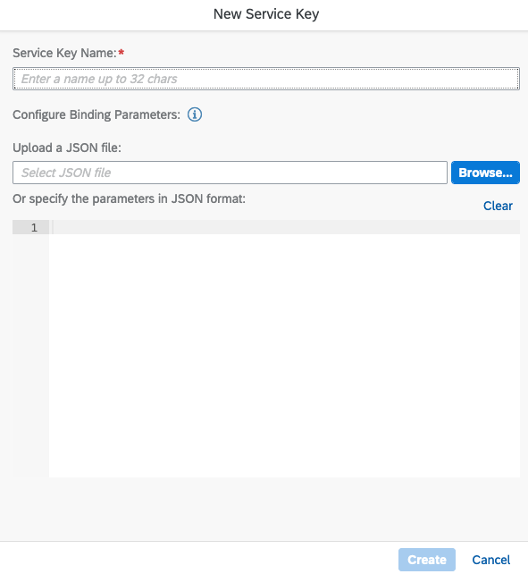

## Setup the Service Key

Now that we have created the instance we need to create a service key. With the service key we will be able to create an oauth token that will give us the ability to query our api.

1. From the Instances table, locate the row with our newly created
   instance name and left click the ellipsis (…).

   The following menu will appear:

2. Choose “Create Service Key” and the following dialog will appear:

3. Choose a name for our service key and click “Create”

4. Our instance should now have a service key attached to it.

5. Left click on the ellipsis to view our service key credentials that
   have been created

6. Select “View” to see our credentials. The sections we are interested
   in are:

>clientid, clientsecret and url.

You could also switch to “Form” View which might be easier to copy the
required information:

