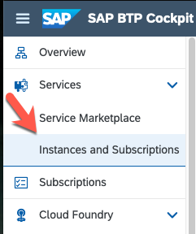
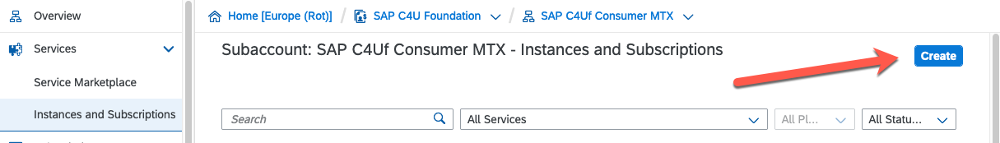
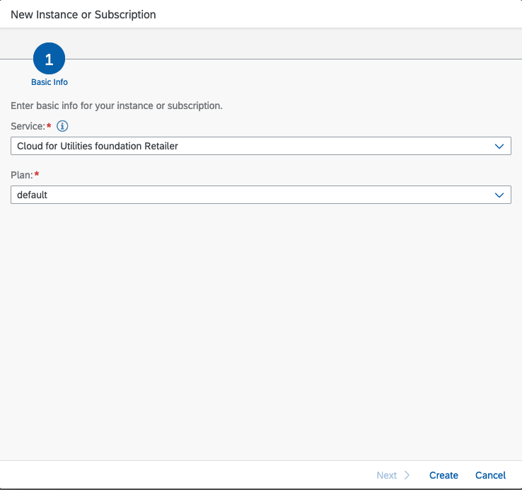
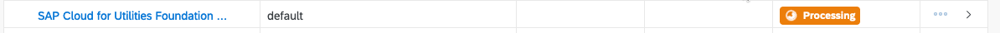
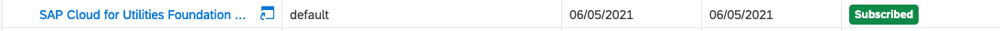

## Subscribe to SAP Cloud for Utilities Foundation Retailer

1. Go to[https://account.hana.ondemand.com](https://account.hana.ondemand.com) and login to your SAP BTP
   Subaccount from where you will be subscribing to SAP Cloud for
   Utilities Foundation Retailer.

   **Note:** If you have more than one subaccount choose the one from where you wish to subscribe C4U

2. Choose “Instances and Subscriptions”

3. Subscribe to C4U from the SAP BTP Cockpit by clicking on “Create”
   button underneath your profile name.

4. A dialog box will appear asking which service you wish to subscribe
   to.

   1. Choose “Cloud for Utilities Foundation Retailer” from the
      dropdown.
   2. Select “default” as the plan.

5. After having subscribed to SAP Cloud for Utilities Foundation
   Retailer Development you will see that the subscription is processing.

6. Once subscription has completed, the status will change from
   processing to completed.

 
