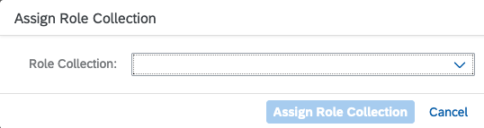

## Assign Existing Users

1. From the BTP Cockpit choose Users underneath the Security menu.

2. Select the user to assign the roles to from the user table by
   selecting the arrow “&gt;” on the far right.

3. Select “Assign Role Collection”.

4. From the dialog box select the Extension roles you wish to assign to
   the user.

5. Use the previously created role collection to assign to your users
   by clicking the Assign Role Collection Button.

6. The developer(s) are now ready to start their extension.

   These roles are defined as “ExtendCDS” and “ExtendCDSDelete”.
   Once these have been added the developer can now start the extension.