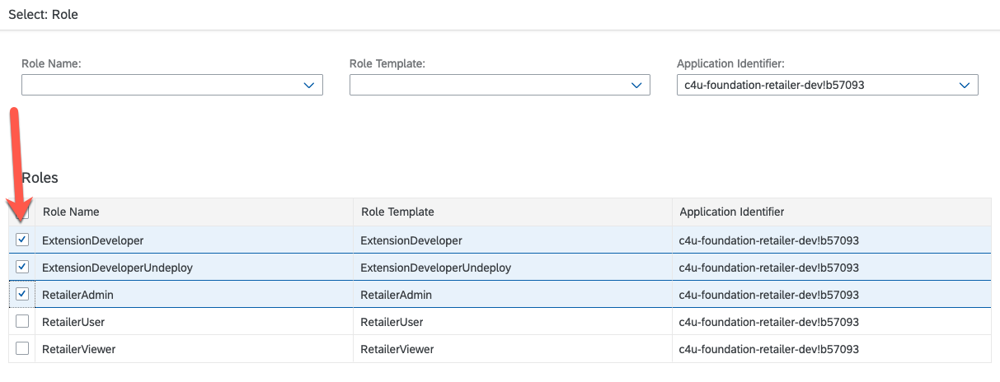
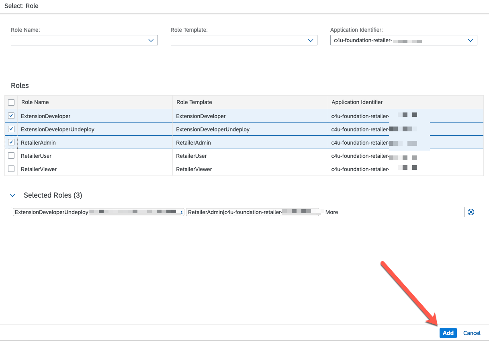
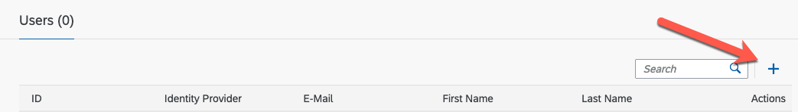
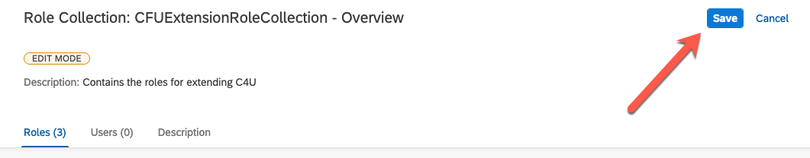

## Setup the Roles for your extension Developers.

C4U CO comes with different roles that need to be assigned to extension
developers. Currently there are two possible roles:

1. **ExtensionDeveloper:**

This role is intended for an extension developer to be able to develop an extension.

2. **ExtensionDeveloperUndeploy:**

   This role is intended for an extension developer to be able to developand extension and also be able to remove it.

   As shown below:

Note: It is also a best practice to assign an application role to the developer so they have the ability to run the application and view the
extension in action.

1. Create the Role Collection

   Depending on the level of granulation you can decide to add other roles
   that are felt the developer should have, however for the purpose of
   developing extensions we will adhere only to the extension roles.

   From BTP Cockpit choose Role Collections as shown below:

2. Create a new role collection by clicking the “+” button.

3. Give a name to the Extension Role Collection you are creating:

Click Create when you are finished.

4. You will now see the newly created role collection in the role
   collection table.

5. Click the Arrow to start adding the roles.

6. From the Role Collection Screen, click the Create button.

7. Choose the appropriate role names from the selection box.

8. Filter your possible selections by choosing c4u-foundation-retailer
   from the Application Identifier.

9. Select the roles for the Extension developer. Choose at a minimum the ExtensionDeveloper to develop extensions. If you wish the
   developer to be able to undeploy the extension then also choose the ExtensionDeveloperUndeploy Role.

   In our example we will also choose the RetailerAdmin, however this is only for demonstration purposes.

10. Select Add when you are finished.

11. Your screen should now be similar to this:

12. Now we can assign the new users to this role collection. If users
    have already been created in your subaccount goto the Assign Users
    section below.

13. Assign the users by entering in their emails

14. Select the users you wish to assign the roles to by Selecting
    “Users” underneath Security in the left-navigation menu and then
    click the “+” button

15. Click save to finish

