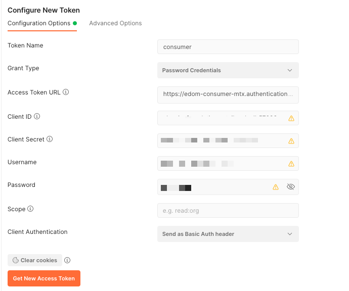

Now that we have created our extension and activated it,
We would like to verify our extensions.


**Prequesites:**

   1. Make sure you are logged in to your correct CF (cloud foundry) subaccount. (In this case the provider).
   2. You have a valid token (authenticated by the subaccount)

   If you notice below the subaccount subdomain is missing in the url. However, this is because its the jwt token that tells the service which subdomain is being requested.
   **Make sure when you test - you authenticate based on the subaccount.**


### Verify your extensions

After you have tested locally and activated the extension we should test to make sure the extended db/services have been updated.

Queries again go to the main account. They are differentiated based on the JWT token that has been authenticated.

1. Use postman to retrieve the proper auth token.
   The token is delivered by the subaccount

    
   

2. Access the subdomain authenticating from the subdomain.

   https://edom-consumer-mtx.authentication.eu10.hana.ondemand.com/oauth/token

   
   Use the service key credentials that you created beforehand.


   > - "clientid": "clientid",
   > - "clientsecret": "clientsecret”
   > - “url”: “url” + ‘/oauth/token’

3. Query the subaccount for the extension, we want to see the metadata:

   ```

   GET:https://c4u-foundation-retailer-dev-service.cfapps.eu10.hana.ondemand.com/api/v1/$metadata

   ```

    

4. View the extended data


