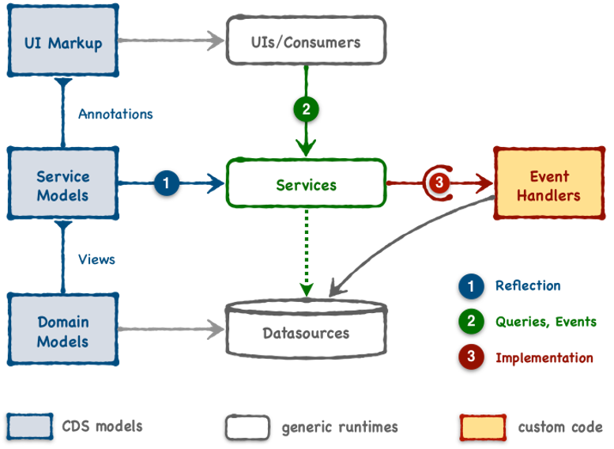

The diagram below gives a rough overview of the CAP components.

1. ### UI Markup:
    >The CAP framework provides out of the box support for SAP Fiori Elements frontends.
    This provides developers with some common templates to speed up development and provide UX consistency and compliance.
    
    For more information on [Fiori Elments](https://experience.sap.com/fiori-design-web/smart-templates/).
    To see how [CAP](https://cap.cloud.sap/docs/advanced/fiori) integrates with Fiori Elements

2. ### Service Models
    >In the CAP Framework services are declared in CDS Models.

3. ### Domain Models
    >Domain Models capture static aspects of problem domains through ER models.
    [See how CDS is used to expose models](https://cap.cloud.sap/docs/about/#domain-modeling)

4. ### Events
    >CAP includes the ability to handle requests (through synchrounous APIs) and event messages (asynchronous)

