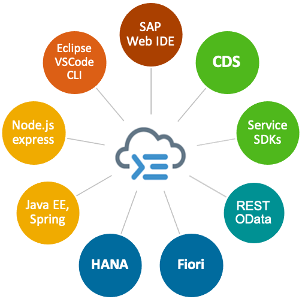

Is an open and opinionated, framework of languages, libraries, and tools for building enterprise-grade
services and applications.

It guides developers through proven best practices and a great wealth of out-of-the-box solutions to recurring tasks.

Projects benefit from a primary focus on domain, significantly accelerated development, and safeguarded
investments in a world of rapidly changing cloud technologies.

More Information can be found on the [SAP CAP Site](https://cap.cloud.sap/docs/about/)

